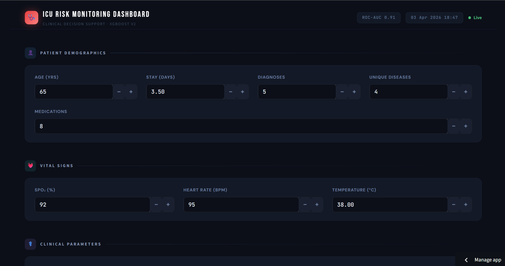
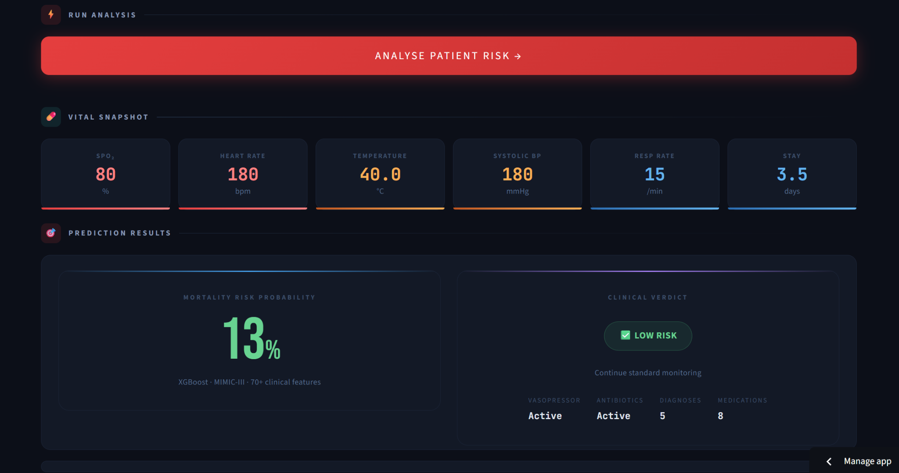
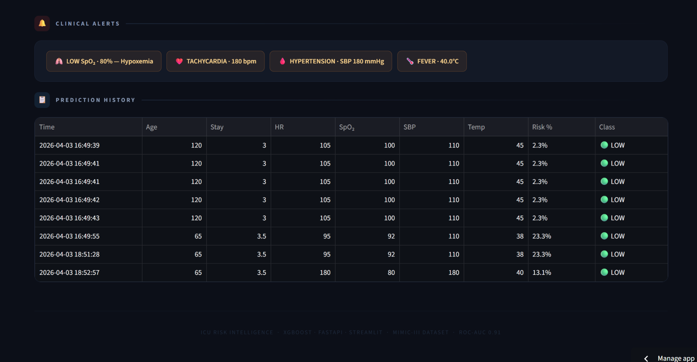

# 🧠 ICU Mortality Prediction System (MLOps)

> Clinical Decision Support System for ICU Risk Prediction using Machine Learning

🌐 **Live App:** https://icu-mlops-project.streamlit.app/
📦 **Repo:** https://github.com/sathwikreddy3008/icu-mlops-project

---

## 🚀 Overview

This project is an **end-to-end Machine Learning system** designed to predict patient mortality risk in Intensive Care Units (ICU) using clinical data.

It integrates:

* 📊 Data Engineering
* 🧠 Machine Learning
* ⚙️ Backend APIs
* 🎨 Interactive Dashboard

👉 Built using the **MIMIC-III clinical dataset**, the system helps in **early risk detection and decision support**.

---

## 🏥 Problem Statement

ICU patients require **continuous monitoring and early risk identification**.
Manual assessment can be slow and inconsistent.

💡 This system:

* Predicts **mortality risk probability**
* Classifies patients into **Low / Medium / High risk**
* Generates **clinical alerts for abnormal vitals**

---

## 🧠 Model Performance

* 🚀 Model: **XGBoost**
* 📈 ROC-AUC: **~0.91**
* 🧩 Features: **70+ engineered clinical features**

---

## ⚙️ System Architecture


```text
┌───────────────┐
│   👤 User      │
└──────┬────────┘
       │ Input patient data
       ▼
┌────────────────────────────┐
│ 🌐 Streamlit Dashboard     │
│ - Input forms              │
│ - Alerts UI                │
│ - Risk visualization       │
└────────┬───────────────────┘
         │ API Request (POST /predict)
         ▼
┌────────────────────────────┐
│ ⚡ FastAPI Backend         │
│ - Input validation         │
│ - Feature alignment        │
│ - Model inference          │
└────────┬───────────────────┘
         │
         ▼
┌────────────────────────────┐
│ 🤖 ML Model Layer          │
│ - XGBoost Model            │
│ - Predict + Probability    │
└────────┬───────────────────┘
         │
         ▼
┌────────────────────────────┐
│ 📦 Model Artifacts         │
│ - model.pkl                │
│ - feature_columns.pkl      │
└────────┬───────────────────┘
         │
         ▼
┌────────────────────────────┐
│ 📊 Response JSON           │
│ {prediction, probability}  │
└────────┬───────────────────┘
         │
         ▼
┌────────────────────────────┐
│ 🎯 Streamlit Dashboard     │
│ - Risk %                   │
│ - Alerts                   │
│ - Gauge chart              │
└────────┬───────────────────┘
         │
         ▼
┌───────────────┐
│ 👤 User Output │
└───────────────┘
```

---

## 🧩 Tech Stack

* **Languages:** Python
* **ML:** Scikit-learn, XGBoost
* **Data:** Pandas
* **Backend:** FastAPI
* **Frontend:** Streamlit
* **Experiment Tracking:** MLflow

---

## 📊 Input Features

### 👤 Patient Demographics

* Age
* ICU Stay Duration
* Diagnoses Count
* Unique Diseases
* Medications

### ❤️ Vital Signs

* SpO₂ (%)
* Heart Rate (bpm)
* Temperature (°C)

### 🏥 Clinical Parameters

* Systolic BP
* Respiratory Rate
* Vasopressor (Yes/No)
* Antibiotics (Yes/No)

---

## 📸 Application Screenshots

### 🔹 Dashboard Input



### 🔹 Prediction Results



### 🔹 Alerts & History



---

## 🔍 Key Features

* ✅ End-to-end ML pipeline
* ✅ Real-time prediction using FastAPI
* ✅ Interactive UI with Streamlit
* ✅ Risk probability visualization
* ✅ Clinical alert system (SpO₂, BP, HR, etc.)
* ✅ Prediction history tracking

---

## 📂 Project Structure

```bash
icu-mlops-project/
│
├── app.py                  # FastAPI backend
├── dashboard.py            # Streamlit UI
├── train.py                # Model training
│
├── models/                 # Saved models
├── data/                   # Raw & processed data
├── notebooks/              # EDA
├── src/                    # Processing & utilities
│
└── requirements.txt
```

---

## ⚙️ How to Run Locally

### 1️⃣ Clone repo

```bash
git clone https://github.com/sathwikreddy3008/icu-mlops-project
cd icu-mlops-project
```

### 2️⃣ Install dependencies

```bash
pip install -r requirements.txt
```

### 3️⃣ Run FastAPI backend

```bash
uvicorn app:app --reload
```

### 4️⃣ Run Streamlit UI

```bash
streamlit run dashboard.py
```

---

## 🔌 API Endpoint

### POST `/predict`

**Input:**

```json
{
  "age": 65,
  "heart_rate": 95,
  "spo2": 92
}
```

**Output:**

```json
{
  "risk_probability": 0.13,
  "risk_level": "Low"
}
```

---

## 📈 Future Improvements

* 🔄 CI/CD pipeline
* ☁️ Full cloud deployment (Azure)
* 📊 Real-time streaming data
* 🧠 Deep learning models
* 📱 Mobile-friendly UI

---

## 🤝 Contribution

Feel free to fork, improve, and contribute 🚀

---

## ⭐ Support

If you like this project, give it a ⭐ on GitHub!
